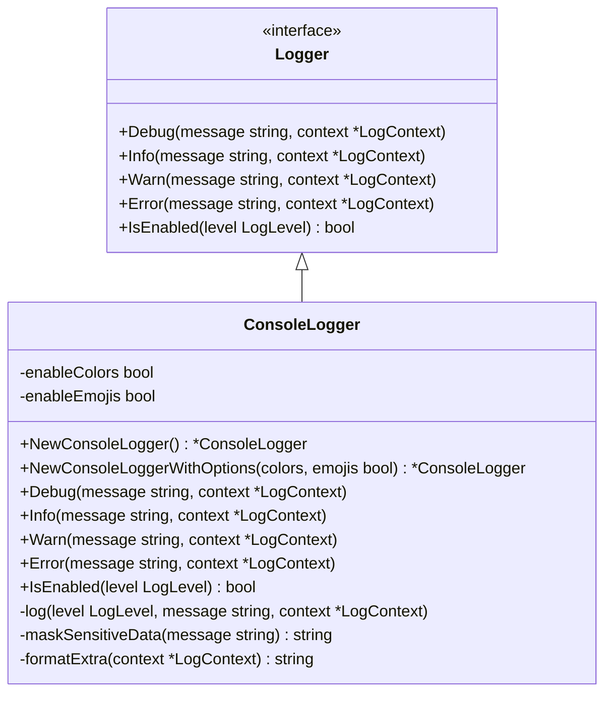
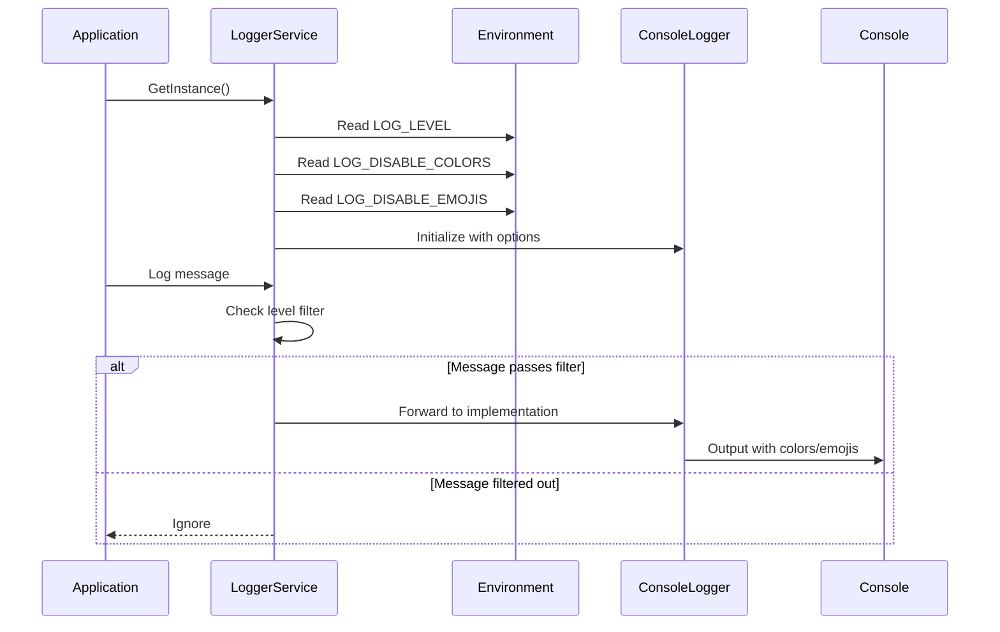
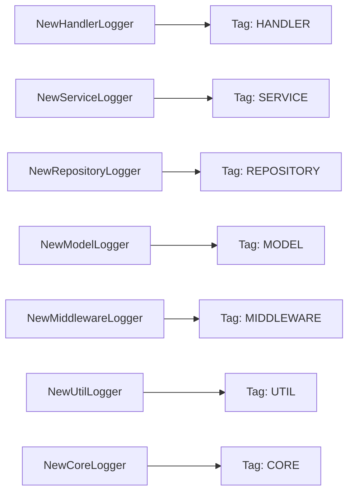
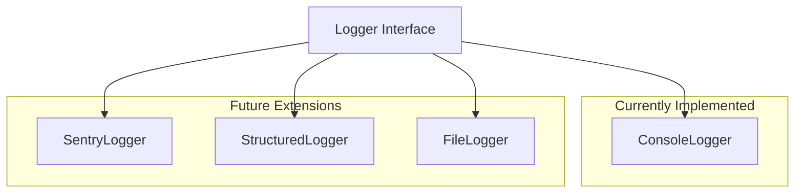
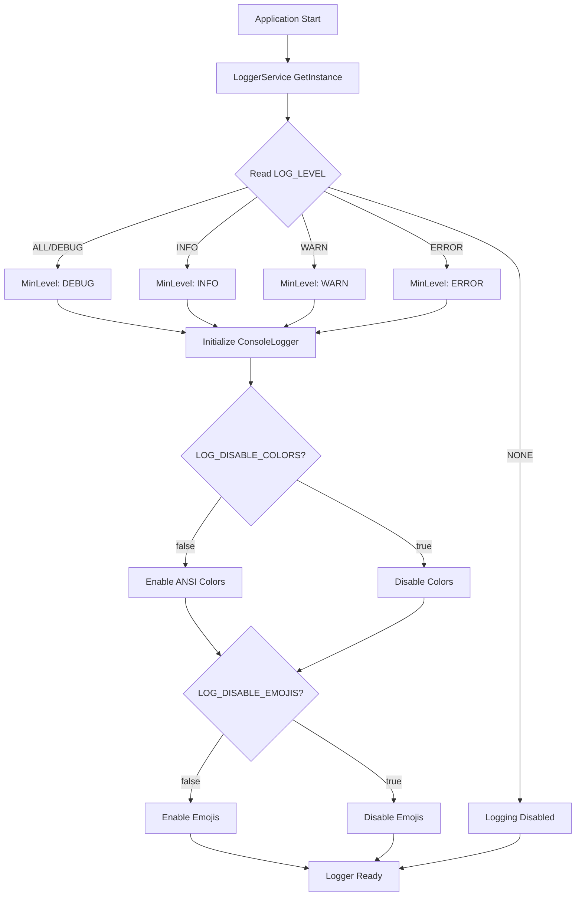

# Logger Architecture Documentation

## Overview

The Cribe Server implements a comprehensive, platform-agnostic logging system designed for performance, security, and ease of use across all application layers following Go best practices.

## Core Components

### 1. Logger Interface

The abstract interface that defines the contract for all logging implementations.



### 2. LoggerService (Singleton)

Central service that manages logging across the application with environment-based configuration.



### 3. ContextualLogger & Utilities

Provides convenient access to logging with automatic context injection and function name detection.

**How it works:**
1. Create a contextual logger for your entity type
2. The logger automatically captures entity type and name
3. Function names are auto-detected via runtime reflection
4. Call logging methods with optional extra context

**Available constructors:**
- `NewHandlerLogger(name)` → Tags logs as `[HANDLER:name]`
- `NewServiceLogger(name)` → Tags logs as `[SERVICE:name]`
- `NewRepositoryLogger(name)` → Tags logs as `[REPOSITORY:name]`
- `NewModelLogger(name)` → Tags logs as `[MODEL:name]`
- `NewMiddlewareLogger(name)` → Tags logs as `[MIDDLEWARE:name]`
- `NewUtilLogger(name)` → Tags logs as `[UTIL:name]`
- `NewCoreLogger(name)` → Tags logs as `[CORE:name]`

## Log Levels & Visual Indicators

| Level | Emoji | ANSI Color | Usage |
|-------|-------|------------|-------|
| Debug | 🔍 | White | Development debugging |
| Info | ℹ️ | Light Blue | General information |
| Warn | ⚠️ | Yellow | Warning conditions |
| Error | ❌ | Red | Error conditions |

## Security Features

### Sensitive Data Masking

The logger automatically masks sensitive information:

- **Emails**: `user****@exam****` (shows first 4 chars + domain first 4 chars)
- **Passwords/Tokens**: `password: ****`
- **JWT Tokens**: `****` (full masking)
- **Regex-based detection**: Automatically finds and masks patterns

## Usage Patterns

### Basic Usage with Contextual Loggers

```go
// In handlers
type AuthHandler struct {
    logger *logger.ContextualLogger
}

func NewAuthHandler() *AuthHandler {
    return &AuthHandler{
        logger: logger.NewHandlerLogger("AuthHandler"),
    }
}

func (h *AuthHandler) HandleLogin(w http.ResponseWriter, r *http.Request) {
    h.logger.Info("Processing login request", map[string]interface{}{
        "method": r.Method,
        "path":   r.URL.Path,
    })

    // ... business logic ...

    h.logger.Error("Login failed", map[string]interface{}{
        "error": err.Error(),
        "email": loginRequest.Email, // Will be automatically masked
    })
}
```

### Quick Logging Functions

```go
// For simple logging without creating logger instances
logger.LogInfo(logger.ServiceEntity, "AuthService", "User authenticated successfully")
logger.LogError(logger.RepositoryEntity, "UserRepo", "Database connection failed")
```

### Entity Type Automatic Tagging



## Platform Extensions

The logger system is designed to be easily extended with platform-specific implementations:



## File Structure

```
internal/core/logger/
├── logger_interface.go        # Abstract interface & types
├── logger_constants.go        # ANSI colors, emojis, formatting
├── console_logger.go          # Console implementation with colors
├── logger_service.go          # Singleton service with env config
├── logger_utils.go            # Contextual loggers & utilities
└── example_usage.go           # Usage examples
```

## Configuration

### Environment Variables

```bash
# .env.development
LOG_LEVEL=ALL                  # Options: ALL, DEBUG, INFO, WARN, ERROR, NONE
LOG_DISABLE_COLORS=false       # Set to true for production logs
LOG_DISABLE_EMOJIS=false       # Set to true for structured logging
```

### Environment-Based Configuration



## Performance Considerations

### Efficient Logging

```go
// Level checking prevents expensive operations
if logger.IsEnabled(logger.DebugLevel) {
    logger.Debug("Expensive debug info", map[string]interface{}{
        "data": expensiveOperation(), // Only called if debug is enabled
    })
}
```

### Goroutine Safety

- LoggerService is thread-safe with sync.Once initialization
- ConsoleLogger output is thread-safe through Go's standard library
- Multiple goroutines can safely use the same logger instance

## Integration Examples

### HTTP Middleware Integration

```go
func LoggingMiddleware(next http.Handler) http.Handler {
    logger := logger.NewMiddlewareLogger("HTTPLogger")

    return http.HandlerFunc(func(w http.ResponseWriter, r *http.Request) {
        start := time.Now()

        logger.Info("Request started", map[string]interface{}{
            "method": r.Method,
            "path":   r.URL.Path,
            "ip":     r.RemoteAddr,
        })

        next.ServeHTTP(w, r)

        logger.Info("Request completed", map[string]interface{}{
            "duration": time.Since(start).String(),
        })
    })
}
```

### Error Handling Integration

```go
func (s *AuthService) Login(req LoginRequest) (*LoginResponse, *errors.ErrorResponse) {
    logger := logger.NewServiceLogger("AuthService")

    logger.Debug("Processing login request", map[string]interface{}{
        "email": req.Email, // Automatically masked
    })

    user, err := s.userRepo.GetUserByEmail(req.Email)
    if err != nil {
        logger.Error("Failed to fetch user", map[string]interface{}{
            "email": req.Email,
            "error": err.Error(),
        })
        return nil, &errors.ErrorResponse{
            Message: errors.InvalidCredentials,
            Details: "User not found",
        }
    }

    logger.Info("Login successful", map[string]interface{}{
        "userID": user.ID,
    })

    return response, nil
}
```
