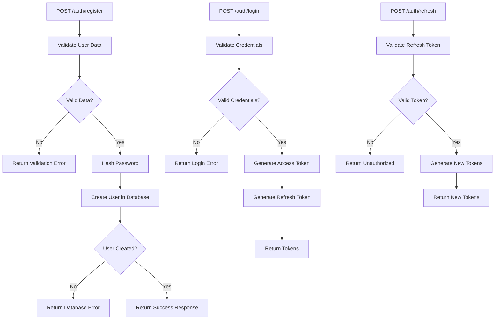
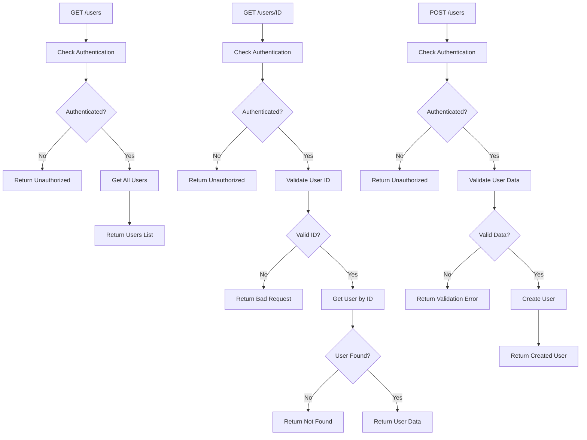
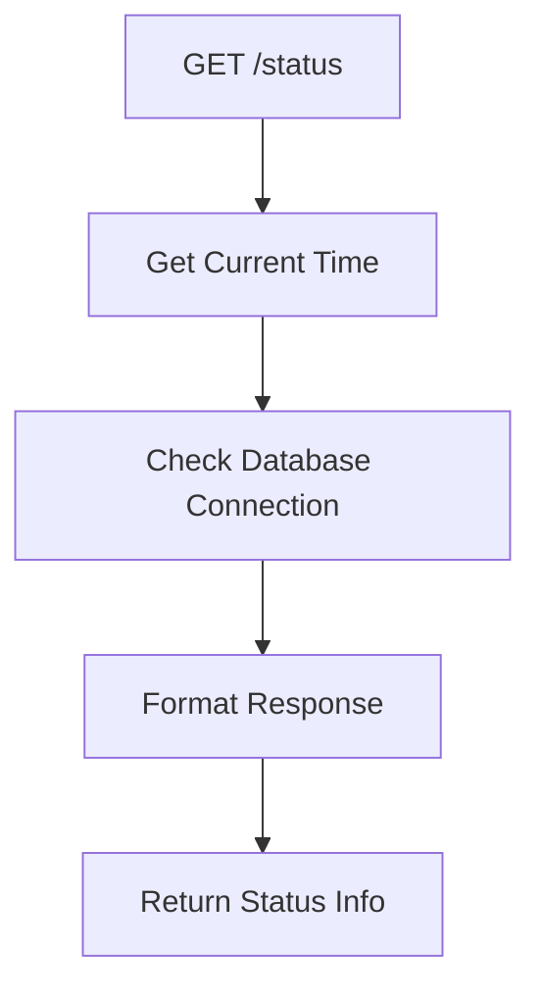
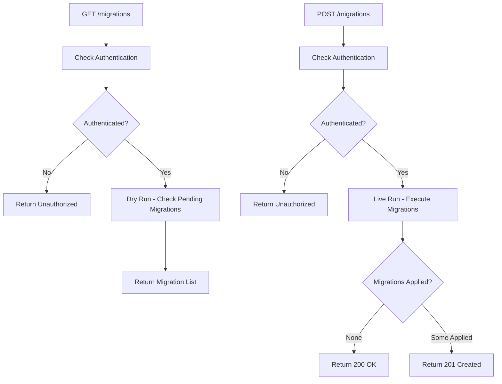
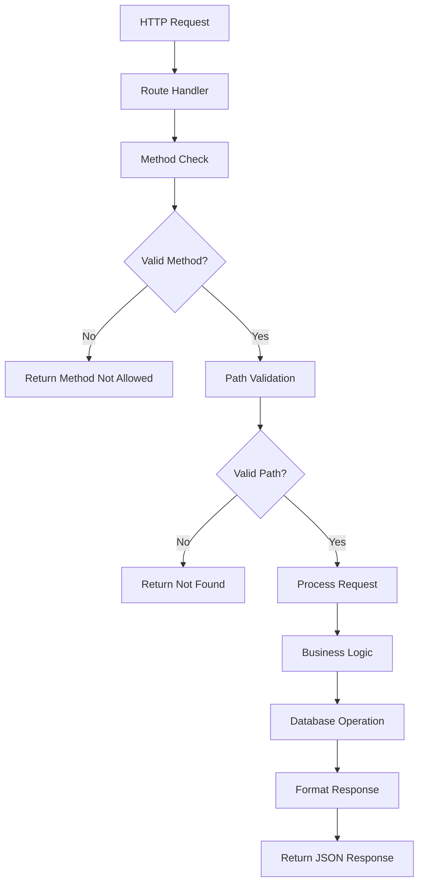
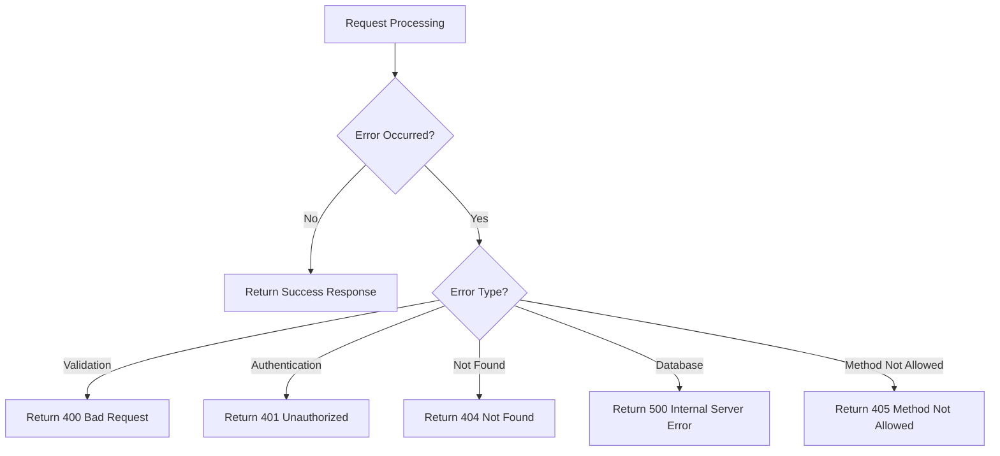

# Cribe Server API Routes

Simple documentation about the API routes in the Cribe Go server - what they do and how they work.

## 🛣️ Routes Overview

The server has 4 main route groups that handle different functionality:

### **Auth Routes** (`/auth/*`)
- **Purpose**: Handle user authentication
- **Endpoints**: `/auth/register`, `/auth/login`, `/auth/refresh`
- **What it does**: User registration, login, and token refresh

### **Users Routes** (`/users/*`)
- **Purpose**: Manage user data (requires authentication)
- **Endpoints**: `/users`, `/users/{id}`
- **What it does**: Create, read user information

### **Status Routes** (`/status`)
- **Purpose**: Health check and system status
- **Endpoints**: `/status`
- **What it does**: Returns server health and database connection status

### **Migrations Routes** (`/migrations`)
- **Purpose**: Database migration management
- **Endpoints**: `/migrations`
- **What it does**: Preview and run database migrations

## 🔐 Auth Routes Flow

## 👥 Users Routes Flow

## 📊 Status Routes Flow

## 🔄 Migrations Routes Flow

## 📝 What Each Route Does

### **Auth Routes**
- **POST /auth/register**: Creates new user account with hashed password
- **POST /auth/login**: Validates credentials and returns JWT tokens
- **POST /auth/refresh**: Generates new tokens using refresh token

### **Users Routes**
- **GET /users**: Returns list of all users (authenticated users only)
- **GET /users/{id}**: Returns specific user by ID (authenticated users only)
- **POST /users**: Creates new user (authenticated users only)

### **Status Routes**
- **GET /status**: Returns server health check with database status and timestamp

### **Migrations Routes**
- **GET /migrations**: Shows what migrations would run (dry run)
- **POST /migrations**: Actually runs pending database migrations

## 🔧 Common Route Patterns

### **Request Processing Flow**

### **Error Handling**

## 🛡️ Authentication Required

Routes that require authentication (checked by middleware):
- All `/users/*` endpoints
- All `/migrations` endpoints
- Any route marked as "private" in the route configuration

Routes that are public (no authentication needed):
- `/auth/*` endpoints
- `/status` endpoint

That's it! The server routes handle authentication, user management, health checks, and database migrations in a simple, RESTful way.
